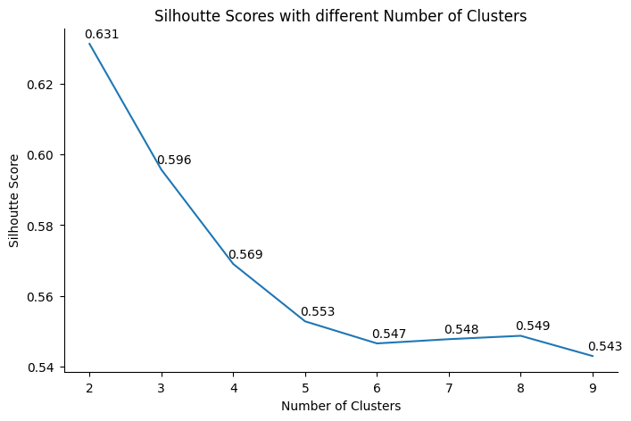
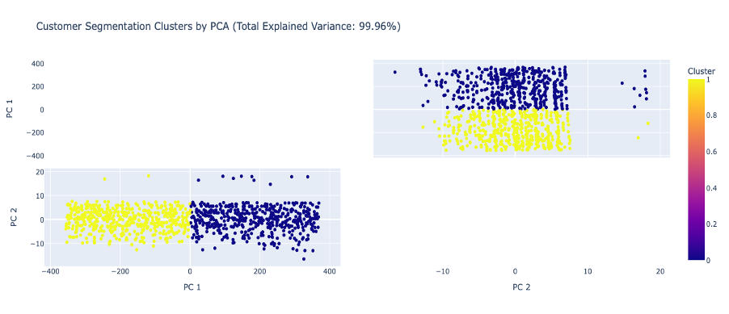
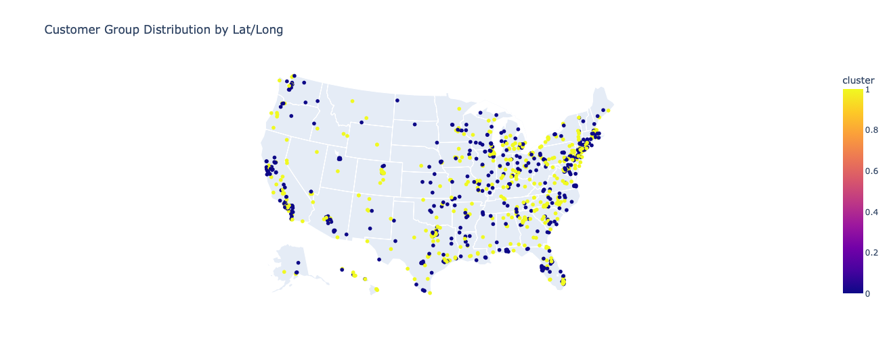
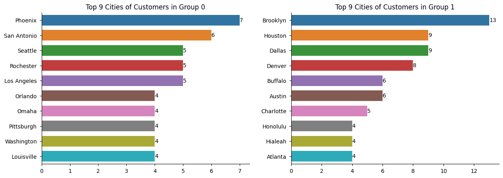
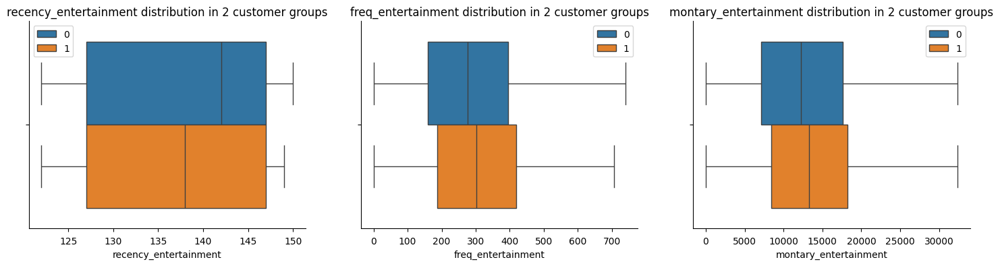
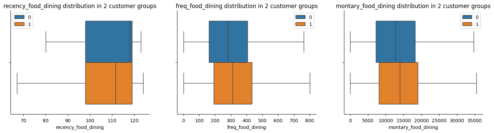
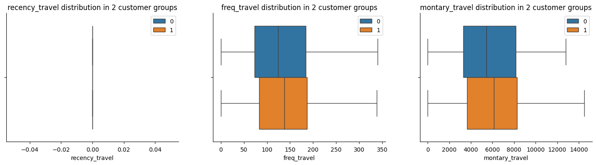
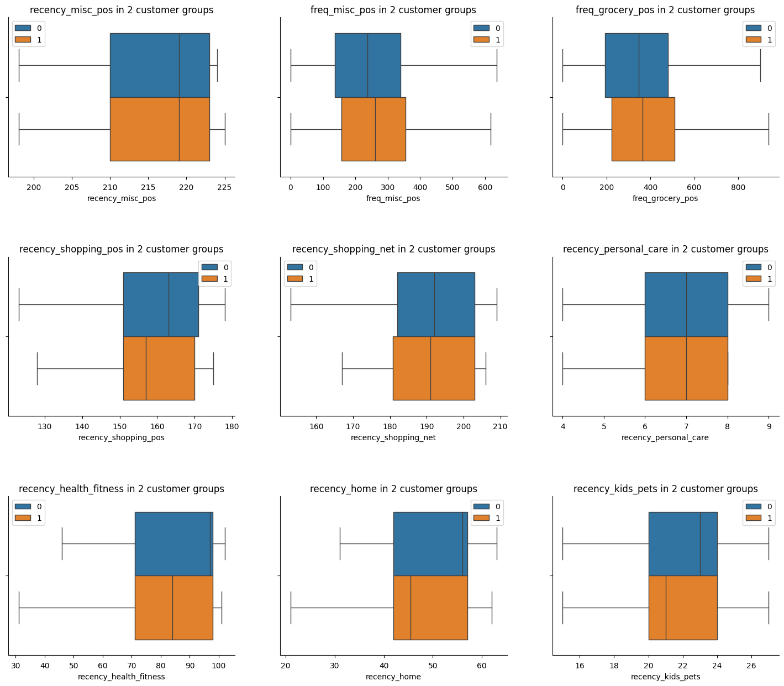

# Overview and Objectives
This project leverages the bank's extensive transactional data collected over the past three
years to develop machine learning solutions that provide direct value to both the business and
its customers.

In this project, various clustering techniques were employed to segment customers based on spending
behaviors, facilitating personalized marketing efforts. 

The project consists of 2 main phases:

1. **Exploratory Data Analysis**: Gain a comprehensive understanding of the dataset, which includes statistical descriptive, univariate analyis, bivariate analysis and multivariate analysis.

2. **Developing Machine Learning Models**: The project developed and bencmarked various models to sucessfully segment customers based on their spending behaviors, which can help the business to tailor their marketing campaigns for each customer.

# Dataset
The dataset can be downloaded [here](https://drive.google.com/file/d/1PUOz2L4862Dqpq3s1_L6oAKLde2dQ8gC/view?usp=sharing). It consists of 2 main parts:
1. **Customer dataset**: The customer dataset contains **approximately 1,000 records** and **15 variables**, including demographic information such as gender, city, state, and
job title.

2. **Transaction dataset**: The transaction dataset comprises **132 CSV files** with a total of
**177,346 records**. It includes **10 variables** detailing transaction specifics, such as transaction number, credit card number, amount, and category.

# Methodologies
## Exploratory Data Analysis
The EDA stage can be summarised as:
- Data cleaning (identifying missing values, duplicated values, outliers, etc.)
- Univariate Analysis (Distribution plot, Log transformation, IQR outliers detection, etc.)
- Bivariate Analysis (Kernel Density Estimation analysis, Spearman rank matrix correlation, Hypothesis testing, ...)

## Model Development
Various clustering algorithms were experimented, which includes KMeans Clustering, DBSCAN and Hierarchical clustering. 

**RFM (Recency-Frequency-Montary)**, a well-known value for better understanding customer transaction behaviors, was leveraged to develop a reliable clustering algorithm. To be more specific, the score consists of: 
- Recency: The number of days since customers' latest transaction in that category
(comparing to the latest transaction in the dataset).
- Frequency: The number of transactions the customer made for that category.
- Montary: The total amount of money the customer spent on that category.

Different feature engineering techniques were performed to enhance the clustering algorithms, which include time-series data transformation, generating RFM values periodically, and generating RFM values independently for each transaction category. **PCA** (Principal Component Analysis) was also leveraged to reduce the feature dimension while still maitaining the model performance.

In final, RFM values for each transaction category of all customers, combining with customer demographic features, resulted in the most reliable KMeans Clustering algorithm.

## Evaluation Metrics
Two evaluation metrics were used to evaluate the model performance:

- **Silhoutte Score**: The score indicates how well clusters are formed. It considers both
point distances within a cluster and between different clusters. The score has range
from -1 to 1, where -1 indicates the worst result and 1 indicate a perfect clustering.
- **Davies-Bouldin Index**: It measures the average ratio of the within-cluster scatter to the
between-cluster separation. It aims to find well-separated clusters with minimal internal
variation. The lower the score is, the better the model is.

## Model Performance 
After various expriments, KMeans Clustering with PCA technique on a set of specific RFM values for each category and customer demographics resulted in the most reliable clusters.

As can be seen from above, The KMeans clustering model with PCA yielded a silhouette
score of **0.631** and a Davies-Bouldin Index (DBI) of **0.491**, indicating reasonable clustering
performance. The silhoutte score may not be perfect, but still indicates some hidden patterns among the customer groups.

## Result Analysis and Business Insights
In order to interpret different patterns in the 2 customer groups, **ANOVA test** was leverage to highlight features that their difference in 2 groups are statistical significant. The p value is set to **0.1** in this case. 

These features can then be categorized based on customer demographics and transaction categories as followed:

**Customer Locations**

The customers in the 2 groups are mainly located in different cities, indicating potential
marketing tailors in based on geography locations.

**Entertainment**

As can be seen from above, Group 1 customers exhibit higher spending on entertainment,
making more frequent and recent purchases compared to other groups. This finding suggests a targeted marketing approach, where the Marketing Team could tailor promotional emails to highlight entertainment offers for this group.

**Food and Dining**

The above figures indicate that Group 1 shows a higher expenditure on food dining,
frequent transactions, and recent activity compared to other groups. This suggests they are
likely more interested in food-related promotions. The Marketing Team could tailor email
campaigns to target this group, focusing on promotions and offers related to food dining to
capitalize on their spending habits and increase engagement.

**Travelling**

The figures above illustrate that Group 1 demonstrates a higher expenditure on travel and more frequent transactions in this category compared to other groups. This suggests a potential affinity
for travel-related products or services among these customers. For the Marketing Team,
this insight presents an opportunity to tailor email campaigns specifically promoting travel-
related offers to customers in Group 1. 

**Other Categories**

Lastly, the above plots reveal that the customers in group 1 exhibit higher activity levels,
particularly in recent transactions across categories like shopping, fitness, home, and pets.
This suggests emerging spending trends that could influence their behavior in the coming years. To capitalize on this insight, the Marketing Team should customize their email campaigns for these customers, aligning with their evolving spending patterns.

# Conclusion
By using **KMean Clustering** with stastical test for result intepretation, we can highlight a customer group (Group 1) which are likely potential customers in some specific categories.

To be more specific, customers in this group tend to **spend more money, more frequently and recently in entertainment, food dining and travelling** compared to others. They also more likely to spend on fitness, home and kids/pets due to their compared to other customers.

Overall, these customers seem to care more about their life style and experience. Marketing Team should tailor the marketing emails sent to them more about these categories to gain attraction and success likelihood.